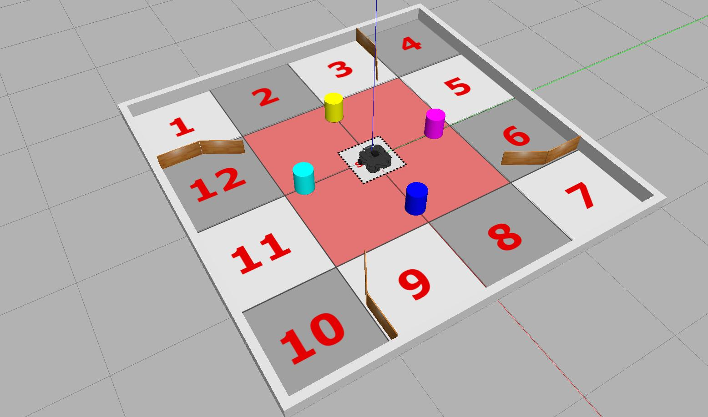

---  
title: "Task 2: Avoiding Obstacles" 
---  

Develop the ROS node(s) that allow a TurtleBot3 Waffle to autonomously explore an environment containing various obstacles. The robot must explore as much of the environment as possible in 90 seconds without crashing into anything!

!!! success "Course Checkpoints"
    
    You should aim to have completed the following *additional* parts of the COM2009 ROS Course to support your work on this task: 

    * **Assignment #1**: Up to and including [Part 5](../../assignment1/part5.md) (in full).
    * **Fact-Finding Missions**:
        * [Mission 1 (Publishing Velocity Commands)](../../../waffles/fact-finding.md#mission-1-publishing-velocity-commands),
        * [Mission 4 (Out of Range LiDAR Data)](../../../waffles/fact-finding.md#mission-4-out-of-range-lidar-data).

## Summary

Assignment #1 Part 3 introduces [the Waffle's LiDAR sensor](../../assignment1/part3.md#lidar). This sensor is very useful, as it tells us the distance to any objects that are present in the robot's environment. In [Part 5 Exercise 4](../../assignment1/part5.md#ex4) we look at how this data, in combination with the *ROS Action framework*, can be used as the basis for a basic obstacle avoidance control system. Building on this in [Part 5, Advanced Exercise 1](../../assignment1/part5.md#adv_ex1), we discuss how this could be developed further into an effective *search strategy* by developing an action *client* that could make successive calls to an the action server to keep the robot moving randomly, and indefinitely, around an arena whilst avoiding obstacles.

This is one approach that you could use for this task, but there are other (and potentially simpler) ways that this could be achieved too. 

In COM2009 Lecture 3 ("Sensing, Actuation & Control"), for instance, you are introduced to *Cybernetic Control Principles* and some of *Braitenberg's "Vehicles,"* which are discussed and implemented on a Lego robot during the lecture! In particular, *"Vehicle 3b"* might well be relevant to consider as a simple method to achieve an obstacle avoidance behaviour.

Another aspect of this task is *exploration*: your robot will be awarded more marks for navigating around more of the environment. Consider the search strategies that are discussed in Lecture 8 ("Local Guidance Strategies"), such as *"Brownian Motion"* and *"Levy Walks."* Could something along these lines be implemented on the 
Waffle?

## Details

The environment that your robot will need to explore for this will, of course, be the Diamond Computer Room 5 Robot Arena, which is a square arena of 4x4m. For the task, the arena will contain a number of *"obstacles,"* i.e.: short wooden walls and coloured cylinders. Your robot will need to be able to detect these obstacles and navigate around them in order to fully explore the space.

1. The robot will start in the centre of the arena.
1. It must explore the environment for 90 seconds without touching **any** of the arena walls or the obstacles within it.

    *The 90-second timer will start as soon as the robot starts moving within the arena.*

1. If the robot makes contact with **anything** before the time has elapsed then the attempt is over.
1. The arena floor will be divided into 16 equal-sized zones and the robot must enter as many of the **outer 12 zones** as possible during the attempt.
1. The robot must be moving for the entire duration of the task. Simply just turning on the spot for the whole time doesn't count!

    <a name="launch"></a>

1. The ROS package that you submit must contain a launch file called `task2.launch`, such that the functionality that you develop for Task 2 can be launched from your package via the command:

    ```bash
    roslaunch com2009_team{} task2.launch
    ```

    **Test this out before submission to make sure that it works!**

1. ROS will already be running on the robot before we attempt to execute your launch file on the laptop that the robot has been paired with. 

!!! note
    The location, orientation and quantity of obstacles in the arena will not be revealed beforehand, so the ROS package that you develop will need to be able to accommodate an unknown environment. 

## Simulation Resources

Within the `com2009_simulations` package there is an example arena which can be used to develop and test out your team's obstacle avoidance node(s) for this task.

!!! info 
    Make sure you [check for updates to the Course Repo](../../../extras/tuos-ros.md#updating) to ensure that you have the most up-to-date version of these simulations.

The simulation can be launched using the following `roslaunch` command:

```bash
roslaunch com2009_simulations task2.launch
```

<a name="avoid_arena"></a>

<figure markdown>
  
  <figcaption>The Obstacle Avoidance development arena.</figcaption>
</figure>

!!! warning
    The location, orientation and quantity of obstacles **will be different** to those in this simulation!

## Marking

There are **20 marks** available for Task 2 in total, awarded as follows:

<center>

| Criteria | Marks | Details |
| :--- | :---: | :--- |
| **A**: Run Time | 8/20 | You will be awarded marks for the amount of time that your robot spends exploring the environment before 90 seconds has elapsed, **or** the robot makes contact with anything in its environment ([as per the table below](#run-time)). **The robot must leave the central zone** (the red zone in the simulation) in order to be eligible for any of these marks. |
| **B**: Exploration | 12/20 | You will be awarded 1 mark for each of the outer 12 arena zones that the robot manages to enter (i.e. excluding the four zones in the middle). The robot only needs to enter each of the 12 zones once, but its full body must be inside the zone marking to be awarded the mark. |

</center>

### Criterion A: Run Time {#run-time}

**Marks:** 8/20

Marks will be awarded as follows:

<center>

| Time (Seconds) | Marks |
| :---: | :---: |
| 0-9 | 0 |
| 10-19 | 1 |
| 20-29 | 2 |
| 30-39 | 3 |
| 40-49 | 4 |
| 50-59 | 5 |
| 60-89 | 6 |
| The full 90! | 8 |

</center>