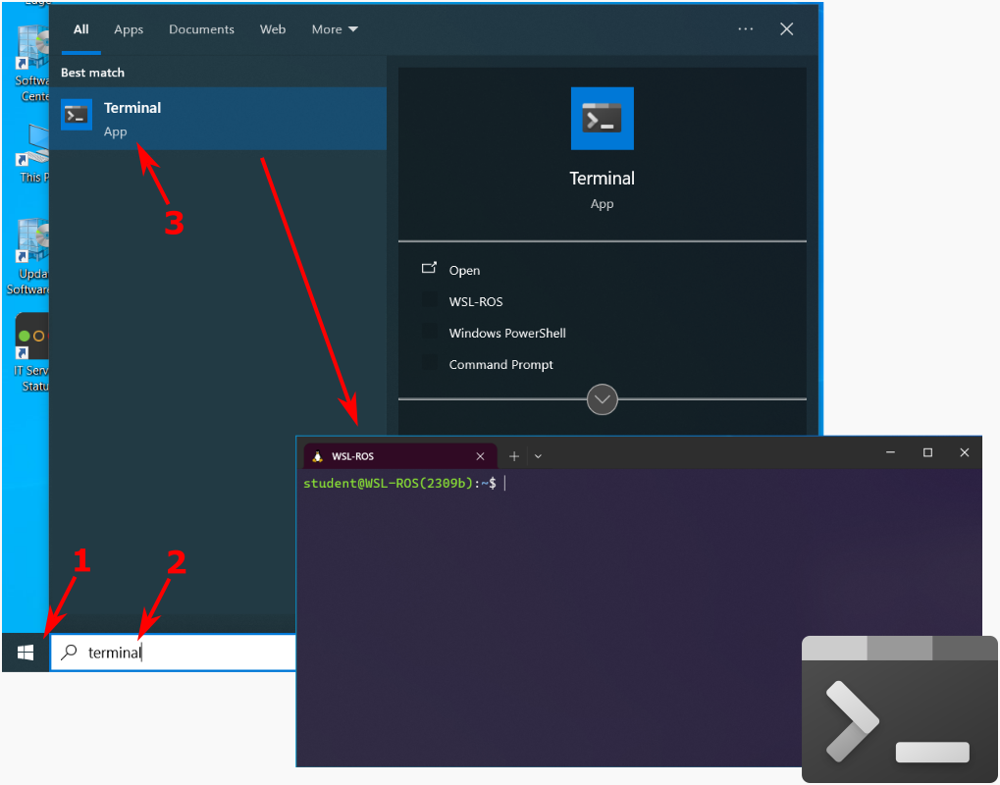

**Applicable for**: Windows 10 or 11 personal (unmanaged) computers

You can install WSL-ROS (our purpose-built ROS image for this course) via the University of Sheffield [Software Download Service](https://students.sheffield.ac.uk/it-services/software/wsl-ros) (University login required).

!!! note
    When you download WSL-ROS from the Software Download Service you will receive an email with installation instructions. We recommend that you follow the instructions provided on *this page* instead, as this page will be kept more up-to-date throughout the semester.

## Prerequisites

1. Your computer must be running Windows 10 **Build 19044 or higher**, or Windows 11.
2. [Update the GPU drivers for your machine](https://learn.microsoft.com/en-us/windows/wsl/tutorials/gui-apps#install-support-for-linux-gui-apps).
3. Install or update WSL:
    1. If you don't already have WSL installed on your machine then follow [these instructions to install it](https://learn.microsoft.com/en-us/windows/wsl/tutorials/gui-apps#fresh-install---no-prior-wsl-installation).
    2. If you *do* already have WSL installed on your machine, then follow [these instructions to update it](https://learn.microsoft.com/en-us/windows/wsl/tutorials/gui-apps#existing-wsl-install).
4. [Install the Windows Terminal](https://learn.microsoft.com/en-us/windows/terminal/install).
5. [Install Visual Studio Code](https://code.visualstudio.com/) and [the WSL extension](https://marketplace.visualstudio.com/items?itemName=ms-vscode-remote.remote-wsl).

## Installing WSL-ROS

1. Go to the [IT Services Software Downloads](https://www.sheffield.ac.uk/software/) page (you'll need to log in with your university MUSE credentials).
2. Scroll down to the bottom, where you should see WSL-ROS listed. Click on the blue "Request WSL-ROS" button and then wait to receive an email to your university email address. 
3. The email will contain a link to the download location. Click this link to download the software to your machine as a `.zip` file (~2 GB).
    
    !!! note "Remember"
        The email will include some installation instructions, but we'd recommend that you follow the instructions provided below instead, just in case anything has changed recently.

4. On your computer, create a new folder in the root of your `C:\` drive called `WSL-ROS`.
5. Extract the content of the downloaded `.zip` file into to the `C:\WSL-ROS\` folder.
6. Launch PowerShell and enter the follow command to install WSL-ROS as a WSL distro on your machine:

    ```powershell
    wsl --import WSL-ROS $env:localappdata\WSL-ROS `
    C:\WSL-ROS\wsl-ros-2309b-SDS.tar --version 2
    ```

    !!! note
        Note that it's important to install this as a [**WSL 2** distro](https://learn.microsoft.com/en-us/windows/wsl/compare-versions#comparing-wsl-1-and-wsl-2), **not** WSL 1 (hence the `--version 2` bit)!

7. This may take a couple of minutes. Once it's done, you can verify that it was successful with the following command:

    ```powershell
    wsl -l -v
    ```

    Where `WSL-ROS` should be listed.

8. Next (optional, but recommended), copy over our recommended settings for the Windows Terminal:
   
    ```powershell
    Copy-Item -Path C:\WSL-ROS\settings.json -Destination `
    $env:localappdata\Packages\Microsoft.WindowsTerminal_8wekyb3d8bbwe\LocalState
    ```

9. You should now be able to launch the WSL-ROS environment by launching the Windows Terminal App:

<figure markdown>
  {width=800px}
</figure>

## See Also

* [Setting up VS Code for WSL](../on-campus/vscode.md)
* [A Quick Introduction to the Linux Terminal](../on-campus/linux-term.md)
* [A Config File for VcXsrv](https://drive.google.com/file/d/1CMJZ6xVXJ2cKZ0NmdYaxUw9RfPsIGLX9/view?usp=sharing)[^vcxsrv]

[^vcxsrv]: [https://sourceforge.net/projects/vcxsrv/](https://sourceforge.net/projects/vcxsrv/)